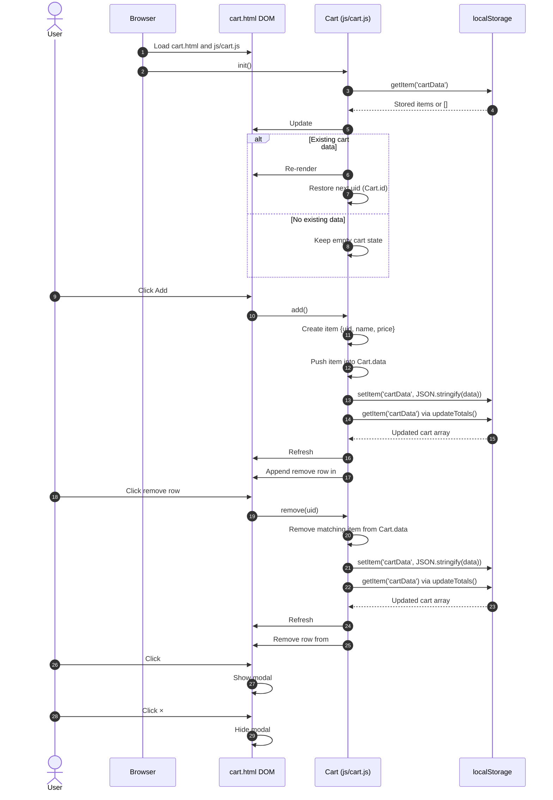

# Local-Storage Shopping Cart

## What this project does
This is a small browser-only cart demo. It lets a user click **Add** to append a hardcoded item (`Lorem Ipsum`, `£12.99`) to a cart, stores cart data in `localStorage`, and keeps the cart bubble + total updated in the header.

## Runtime flow (high level)
1. `cart.html` loads and includes `js/cart.js`.
2. `Cart.init()` runs immediately.
3. `init()` calls `updateTotals()` to read `cartData` from `localStorage` and update:
   - item count bubble (`#units`)
   - total price text (`#total`)
4. If stored items exist, `init()` re-renders remove links in the modal list (`#cartList`) and restores the next unique `id`.
5. Clicking **Add** triggers `Cart.add()`:
   - create item with unique `uid`
   - push into in-memory `Cart.data`
   - persist via `saveData()`
   - render a new removable list row in the modal
6. Clicking a remove row triggers `Cart.remove(uid)`:
   - remove from `Cart.data`
   - persist and recompute totals
   - remove row from DOM
7. Clicking the cart bubble opens the modal; clicking `×` closes it.

## Mermaid sequence diagram

## Important note vs PromoGuard spec
The repository-level `AGENTS.md` defines PromoGuard rules (VIP discount, Eco-Tax, no coupon stacking), but the current implementation in `js/cart.js` does **not** yet implement category-based tax, discount tiers, or coupon-code validation logic.
